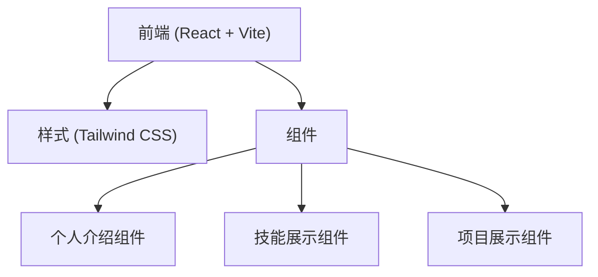

## 1. 架构设计



## 2. 技术描述

- **前端**: React@18 + TypeScript + Tailwind CSS@3
- **初始化工具**: Vite
- **后端**: 无（纯前端项目）
- **图标库**: Lucide React
- **动画**: 原生 CSS 动画 + Framer Motion

## 3. 路由定义

| 路由 | 用途 |
|-------|-------|
| / | 首页，包含所有模块 |

## 4. 数据结构

### 4.1 技能数据结构

```typescript
interface Skill {
  name: string;
  level: number; // 0-100
  icon: string;
}
```

### 4.2 项目数据结构

```typescript
interface Project {
  id: string;
  title: string;
  description: string;
  image: string;
  tags: string[];
  link: string;
}
```

### 4.3 个人信息数据结构

```typescript
interface Profile {
  name: string;
  avatar: string;
  bio: string;
  email: string;
  socialLinks: {
    github?: string;
    linkedin?: string;
    twitter?: string;
    website?: string;
  };
}
```

