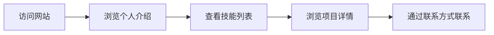

## 1. 产品概述

个人作品集网站，用于展示个人信息、技能和项目经验，向潜在雇主或客户展示专业能力。

- 主要目的是提供一个专业、美观的在线名片，展示个人技术能力和项目成果
- 目标用户为招聘人员、潜在客户和技术合作伙伴

## 2. 核心功能

### 2.1 功能模块

1. **首页**: 个人介绍、导航、技能展示、项目展示
2. **联系方式**: 内嵌在个人介绍部分

### 2.2 页面详情

| 页面名称 | 模块名称 | 功能描述 |
|---------|---------|---------|
| 首页 | 个人介绍 | 显示姓名、头像、个人简介、联系方式（邮箱、社交媒体链接等） |
| 首页 | 技能展示 | 以可视化方式展示技术技能，包括技能名称和熟练度 |
| 首页 | 项目展示 | 展示项目列表，每个项目包含截图、描述、技术栈和项目链接 |

## 3. 核心流程

用户访问网站 → 浏览个人介绍 → 查看技能列表 → 浏览项目详情 → 通过联系方式联系

## 4. 用户界面设计

### 4.1 设计风格

- **主色调**: 深色背景配合高对比度的强调色（深蓝色 + 青色）
- **按钮风格**: 圆角矩形，带有微妙的悬停动画效果
- **字体**: 使用现代无衬线字体，标题使用有特色的展示字体
- **布局风格**: 网格布局，卡片式设计
- **图标**: 使用简约的线性图标

### 4.2 页面设计概述

| 页面名称 | 模块名称 | UI 元素 |
|---------|---------|---------|
| 首页 | 个人介绍 | 居中布局，大尺寸头像，渐变背景，姓名突出显示，联系方式使用图标+文字 |
| 首页 | 技能展示 | 技能卡片网格，每个技能带有进度条或百分比显示 |
| 首页 | 项目展示 | 项目卡片网格，悬停时显示详情，带有平滑过渡动画 |

### 4.3 响应式设计

- 桌面端：多列网格布局，充分利用屏幕空间
- 平板端：自适应列数
- 移动端：单列布局，优化触摸交互，调整字体大小和间距

